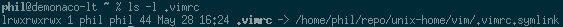

A quick, somewhat elegant way to manage my configuration files. 

## Apply Config

1. Simply clone the repo down to a local directory.

    ```bash
    mkdir -p "${HOME}/repo/unix-home"
    cd "${HOME}/repo/unix-home"
    git clone git@github.com:pdemonaco/home.git .
    ```
2. Execute mklinks.

    ```bash
    ./repo/unix-home/mklinks
    ```

Note that if an existing file is encountered it moved to a backup.

## Structure

File and directory links are divided up into application and/or category specific folders within this repo. The mklinks script assumes that the contents of each of these folders should be rooted at `$HOME`. 

For each directory the script attempts the following actions:

1. Find all files with the extension `.symlink`. For each file:
  * Create the parent directories.
  * Rename the existing file if it exists to name.bak.
  * Create a link named after the prefix targeting the symlink. 
2. Find all files with the extension `.dir`. For each file:
  * Create a directory with the same name in the corresponding `$HOME` location.
 
Here's an example of a symlink created by mklinks:


